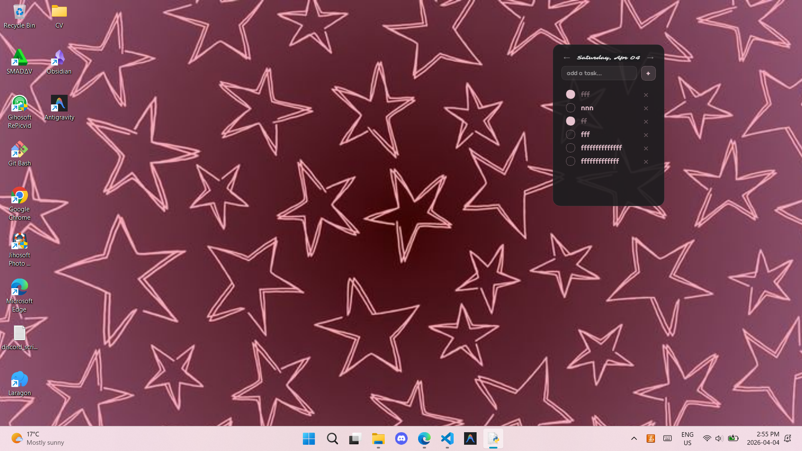
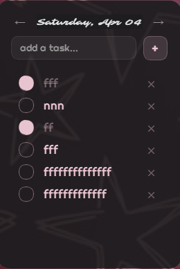

# ✦ Desktop To-Do Widget

A lightweight, aesthetic desktop to-do list widget for Windows — built with Python and PyQt5.  
Sits on your desktop like a phone widget. No browser, no Electron, no bloat.



---

## ✦ Features

- Add and delete tasks
- Check off tasks with strikethrough
- Date navigation — browse tasks by day with ← →
- Auto-carries unfinished tasks to the next day
- Tasks saved locally to `tasks.json` — persists after closing
- Drag to move anywhere on screen
- Resizable like any normal window
- Launches silently on Windows startup — no terminal window
- Dark macOS-inspired aesthetic with custom fonts

---

## ✦ Preview



---

## ✦ Tech Stack

- **Python 3**
- **PyQt5** — UI framework
- **JSON** — local task storage
- **Fonts** — Sarina + Righteous (Google Fonts)

---

## ✦ Installation

**1. Clone the repository**

```bash
git clone https://github.com/YOUR_USERNAME/todo-widget.git
cd todo-widget
```

**2. Create a virtual environment**

```bash
python -m venv venv
venv\Scripts\activate
```

**3. Install dependencies**

```bash
pip install PyQt5
```

**4. Run the widget**

```bash
python main.py
```

---

## ✦ Auto-start with Windows

1. Open File Explorer and navigate to `shell:startup` in the address bar
2. Right click `run.bat` → Show more options → Create shortcut
3. Move the shortcut into the Startup folder
4. The widget will now launch automatically every time Windows starts

---

## 🐧 Linux / Mac Users

**Run the widget:**

```bash
chmod +x run.sh
./run.sh
```

**Auto-start with Linux:**
Add `run.sh` to your startup applications via your desktop environment settings.

---

## ✦ Project Structure

```
todo-widget/
│
├── main.py          # Entry point — launches the app
├── widget.py        # Main widget UI and logic
├── tasks.json       # Auto-generated task storage
├── run.bat          # Silent launcher (no terminal)
├── fonts/
│   ├── Sarina-Regular.ttf
│   └── Righteous-Regular.ttf
└── images/
    ├── bg.png
    └── widget.png
```
